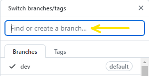
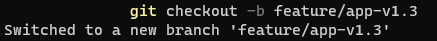
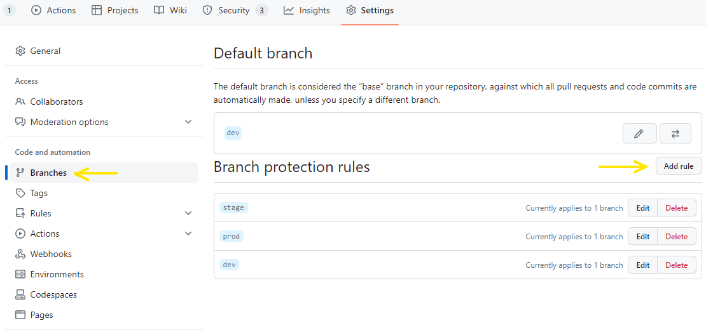
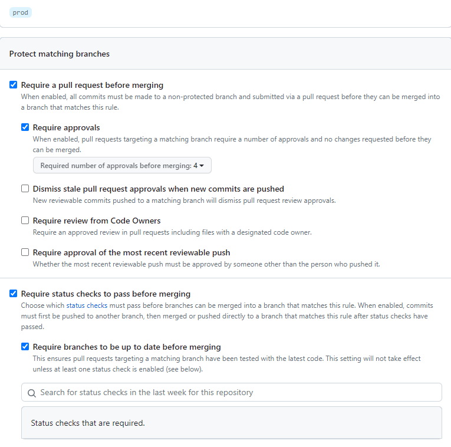
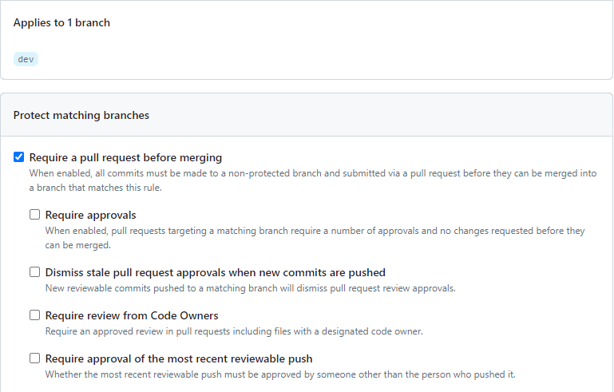

# (SCTP) Cloud Infrastructure Engineering Capstone Project Documentation
## Case 3 - Securtiy Focused (DevSecOps)
### by Group 2: Chan Weng Siong, Chris Pang, David Suntama, Lim Poh Guan and Ng Poh Leng

## Company Profile
ChatSecure is a dynamic and innovative tech startup specializing in DevSecOps services. Founded in 2023, our company brings together a team of five dedicated tech experts with a shared passion for enhancing software development and operational processes through security-first practices. We are committed to helping organizations achieve a secure and efficient software development lifecycle.

## Company Mission Statement
At ChatSecure, our mission is to empower businesses to seamlessly integrate security into their software development and operations. We strive to create a culture of security awareness while expediting the delivery of robust software solutions, thus reducing vulnerabilities and risks.

## Core Services
1. DevSecOps Consulting: Our team of DevSecOps specialists, including Chris, David, Poh Guan, Poh Leng, and Weng Siong, provides expert guidance and tailored strategies to facilitate the effective adoption of DevSecOps principles within your organization.
2. Secure CI/CD Pipeline Setup: We design, develop, and implement secure Continuous Integration and Continuous Deployment (CI/CD) pipelines that include automated security testing and compliance checks, streamlining your development workflows while enhancing security measures.
3. Vulnerability Management: ChatSecure offers comprehensive vulnerability assessment and management services, identifying and mitigating security weaknesses in your applications and infrastructure, ensuring early detection and remediation of potential threats.
4. Security Automation: Leveraging cutting-edge automation tools and techniques, we seamlessly integrate security throughout your software development lifecycle. This includes automated code scanning, configuration management, and threat detection.

## Our Team
Our developers are the architects behind Project Titanium. They leverage their expertise in programming languages, such as Python, Java, and C++, to design, develop, and implement robust and scalable software solutions. Their skills range from front-end development for intuitive user interfaces to back-end systems that power our products' functionality:

1. Weng Siong - Co-founder and CEO, a visionary leader with a cybersecurity and software development background (CI/CD/SCA).
2. Poh Leng - Chief Security Officer (CSO), a seasoned security specialist with expertise in threat detection and incident response (CI/CD/SAST).
3. Poh Guan - Security Analyst, proficient in vulnerability assessment and management (CI/CD/OIDC/Docker).
4. David - Security Analyst, proficient in vulnerability assessment and management (CI/CD/OIDC/IaC).
5. Chris - DevOps Engineer, experienced in building secure CI/CD pipelines and automation (CI/CD/DAST).

<br>

## Showcase Project
Project Name: Titanium

Repository: [Titanium Project Repo](https://github.com/Dylon-Chan/group2-capstone-project)

<br>

## Architecture
*** Diagram Chris

## Requirement / Criteria for Project Titanium
1. A typical CICD Pipeline
2. Implement dependency screening in CI Script
3. Ensure proper authentication and authorization in each environment in CD Script. (e.g. credentials used for deploying development and production environments should not be the same)
4. Proper handling of CICD Pipeline Secrets

## Getting started
### To get the Node server running locally:
1.	Clone this repo
2.	npm install to install all required dependencies
3.	Use snyk to scan for vunlerabilities
4.	Deploy to dev, stage or production environment respectively

## Dependencies
1.	Dockerfile - to create a Docker image, which is a lightweight, standalone, executable package that includes all the necessary components to run a piece of software
2.  Node Express framework
3.  Socket.io

## Application Structure
###	index.js - The entry point to our application. This file for unit testing. It also requires the routes and models we'll be using in the application.

## CICD Pipeline
pre-deploy to check the application
npm install to install all required dependencies
deploy to deploy chat application to development, stage or production respectively

## Workflow for Project Titanium


## Branching Strategies


### Development Branch (Dev)
https://github.com/Dylon-Chan/group2-capstone-project/dev
- The dev branch, short for development branch, serves as the primary integration branch for ongoing development work.
-	It acts as a staging area for features and bug fixes before they are merged into the main branch.
- Developers regularly merge their completed feature branches into the dev branch for integration testing and collaboration.
- Continuous integration practices are often implemented on the dev branch, allowing automated testing and verification of code changes.

### Stage Branch (Stage)
https://github.com/Dylon-Chan/group2-capstone-project/stage

- The stage branch, short for Stage branch, serves as the User Acceptance Test (UAT) for ongoing testing.
- It acts as a staging area for testing before deploy Production environment


### Production Branch (Prod)
https://github.com/Dylon-Chan/group2-capstone-project/prod

- The main branch, also known as the master branch, represents the production-ready state of the application.
- It contains stable and thoroughly tested code that is ready to be deployed to the live environment.
- Only fully reviewed and approved code changes are merged into the main branch.
- It is typically protected, meaning that direct commits or modifications are restricted, and changes can only be introduced through pull requests after thorough code review and testing.


## Branch Creation
There are two methods to create branch in GitHub: through the GitHub website and using a local environment followed by pushing to GitHub.

1. Create environment branches in GitHub website - `dev`, `stage` and `prod`. 
-	Navigate to the desired repository on the GitHub website.
-	Click on the branch dropdown list.
-	Enter the branch name and select "Create branch".



2. Create other feature branches in local machine and push to GitHub
-	Open the CLI terminal.
-	Navigate to the repository's directory.
-	Create a new branch using the following command. This command will create a new branch and switch to the new branch immediately.
    ```git
    git checkout -b <branch name>
    ```
-	Push the branch to GitHub using:
    ```git
    git push <branch name>
    ```
- If the branch isn't recognized on GitHub yet, use:
    ```git
    git push --set-upstream origin <branch name>
    ```

  **Note:** If you wish to create a branch without switching to it, use:
    ```git
    git branch <branch name>
    ```



## Branch Protection
Branch protection is a critical aspect of maintaining code integrity in a collaborative environment. It enforces rules on the specific branches and prevents unauthorized changes to the codebase.

**Steps to enable branch protection in GitHub:**
1. Navigate to the repository on the GitHub website.
2. Click on the "Settings" tab.
3. Click on the "Branches" tab.
4. Click on the "Add rule" button.
5. Enter the branch name to be protected.
6. Set up the branch protection rules as per team's requirement.



In this project, branch protection has been implemented for the `dev`, `stage` and `prod` branches. The following rules are enforced on these branches:

## `Prod` and `Stage` branches
Both require a pull request (PR) prior to merging:
- For `prod`: PR must be reviewed by all four team members.
- For `stage`: PR requires at least two team members reviews.
- Both branches require status checks to pass and must be up-to-date before merging.
- Administrators cannot override these branch protection rules.



## `Dev` branch
This branch solely requires a PR before merging, streamlining the process for team members to merge feature branches into dev for testing and collaboration.



# Best Practices on Branch Management

- Descriptive Naming: Choose clear and meaningful names for feature branches. This aids in collaboration and simplifies code review processes.
- Clean House Regularly: Remove outdated branches both locally and on GitHub periodically. A streamlined repository is easier to navigate and manage.
- Stay Synced: Consistently pull the latest changes from the main (or base) branch into your feature branches. Doing so reduces the risk of merge conflicts.
- Pre-merge Checks: Before merging a feature branch into the base branch, merge the latest changes from the base branch into your feature branch. This ensures that your feature branch is current and minimizes unforeseen integration issues.

# Chat Application
## Scan the following QR code to try on our chat application.


<br>

## The frontend of the chat screen is as below.


<br>

ChatSecure offers a dynamic platform for instant messaging. Upon accessing, users are prompted to set a unique username. To make each participant distinct, the system automatically assigns a unique color to every username. Moreover, users can see the new joiners and the current number of participants in the chat room, adding a layer of interactivity.

## Application Architecture
### Backend:
Crafted with NodeJS, the backend harnesses the power of the Express framework for the web functionalities. Real-time communication is achieved through the socket.io library.
Frontend:
### Frontend: 
The user interface is designed using a blend of HTML, CSS, and JavaScript.
### Source Code Organization:
Client-side code resides in the public folder. For server-side functionalities, refer to the index.js file.

## Package and Dependency Installation
Once the application source codes are available, we can install the required packages and dependencies. This can be done by running the following command in the terminal:
```bash
npm init                        # Create the package.json file
npm install express socket.io   # Install the required packages
```

`package.json`:
```json
{
  "name": "group2-capstone-project-chat",
  "version": "1.0.0",
  "description": "ChatSecure App",
  "main": "index.js",
  "author": "SCTP Cohort 2 Group 2",
  "dependencies": {
    "express": "~4.17.1",
    "socket.io": "^4.0.0"
  },
  "scripts": {
    "start": "node index.js",
    "test": "jest"
  },
}
```
For local exploration, update the scripts as above and launch the application:
```bash
npm start
```
You can now access the ChatSecure magic by heading over to http://localhost:3000 in your browser.

## Unit tests
Testing is intended to maintainability and functionality of our code. Since even small changes can have a significant impact, we ensure that our tests are updated with our code in order to reduce the likelihood of encountering a bug in the future.

1. Install Jest with npm
   ```
   $ npm install --save-dev jest
   $ npm install --save-dev socket.io-client
   ```
   The *--save-dev* flag updates the `devDepenendices` in package.json. They are only used for testing and development on a local basis.

   package.json

  ```json
  "devDependencies": {
    "jest": "^29.6.4",
    "socket.io-client": "^4.7.2"
  }
   ```

2. Test folder and test script
As soon as Jest is executed, it searches our repository for tests. The practice of keeping our test scripts in a folder is recommended.
   

  

4. Run the unit test - **`local testing`**

```sh
$ npm test
> group2-capstone-project-chat@0.0.0 test
> jest

 PASS  __tests__/username_colour.test.js
 PASS  __tests__/colour_array.test.js
 PASS  __tests__/socket.test.js

Test Suites: 3 passed, 3 total
Tests:       6 passed, 6 total
Snapshots:   0 total
Time:        0.487 s
Ran all test suites.
```
The output from **npm test** command shows that the unit test has passed.

The unit test has been successfully run locally. This unit test will be included in the CI/CD pipeline and will be automatically triggered through the [GitHub Actions](#github-actions) workflow.
<br>

## Containerization with Docker
Docker encapsulates applications within containers, providing an environment-agnostic platform to ensure uniform behavior across varying setups. Containerizing our ChatSecure application ensures consistent behavior across different environments, from local development to production deployment.

To initiate this, a Dockerfile is essential for Docker image construction.

### Dockerfile:
```bash
#use nodejs with latest version
FROM node:latest

#set working directory
WORKDIR /app

#install the app dependencies
#use wildcare to copy both package.json and package-lock.json
COPY package*.json ./
RUN npm install

#bundle app source
COPY . .

#expose port
EXPOSE 3000

#start the app
CMD ["npm", "start"]
```
### Local Docker Image Build and Run:
1. Navigate to the root directory which contain the Dockerfile and build the Docker image with the following.
```bash
docker build -t chatsecure-app:latest .
```
This constructs a Docker image tagged `latest` under the name `chatsecure-app`
2. Launch the application inside a Docker container using:
```bash
docker run -d -p 3000:3000 chatsecure-app:latest
```
3. Open your browser and navigate to `http://localhost:3000` to access the application.

<br>

Subsequently, this `Dockerfile` will play a pivotal role in our CI/CD pipeline, facilitating the automated build and push of the Docker image to AWS ECR.

## Infrastructure in Different Environment
**... to briefly describe what are the infra we have in dev, stage and prod differently. (different set of infra resources)**


## Vulnerability Scan  <Shall we put under Github Actions section?>
In our CI/CD pipeline, comprehensive package vulnerability scanning is absolutely essential. This practice involves multiple layers of security checks, including Static Application Security Testing (SAST), Software Composition Analysis (SCA), Infrastructure as Code (IaC) scanning, and Container scanning.

We will begin by locally validating each test to ensure the correct implementation of the Snyk security scan software. 

Subsequently, we will automate the same test in our Continuous Integration (CI) process.  This process employs a server known as a GitHub-hosted runner to monitor the repository and conduct each security scan during continuous integration testing, which we will explain in more detail later.

### Static Application Security Testing (SAST)
SAST focuses on analyzing the source code of our applications for security vulnerabilities. It examines the codebase for potential issues, such as insecure coding practices, known vulnerabilities, and code logic flaws. 

### Run SAST scan - `local testing`
For the SAST scan, we will employ Snyk Code analysis and generate results locally. 
```sh
$ snyk code test 
...(truncated)....
✔ Test completed
```

### Software Composition Analysis (SCA)
SCA plays a vital role in identifying vulnerabilities in our project's dependencies and third-party packages. It scans the components and libraries used in our software, checking for known vulnerabilities and outdated dependencies. 

### Run SCA scan - `local testing`
For SCA scan, we will use Snyk Open Source analysis and uploads result to Snyk.
```sh
$ snyk test --all-projects 
...(truncated)....
✔ Tested 65 dependencies for known issues, no vulnerable paths found.

$ snyk monitor --all-projects
...(truncated)....
Explore this snapshot at https://app.snyk.io/org/dylon-chan/project/17b1d8b9-d5b0-4e55-8af8-dff2eac1eb71/history/46fa1190-9567-4072-8671-00a7a4f14236

Notifications about newly disclosed issues related to these dependencies will be emailed to you.
```

### Infrastructure as Code (IaC) Scanning
IaC scanning is crucial for evaluating the security of our infrastructure scripts and configurations. It examines our infrastructure code to identify misconfigurations, insecure settings, and potential risks. 

### Run IaC scan - `local testing`
For IaC scan, we will use Snyk Infrastructure as Code analysis and uploads result to Snyk.
```sh
$ snyk iac test --report
Snyk Infrastructure as Code

- Snyk testing Infrastructure as Code configuration issues.
✔ Test completed.

Issues
  No vulnerable paths were found!

...(truncated)....

Report Complete

  Your test results are available at: https://snyk.io/org/dylon-chan/projects
  under the name: Dylon-Chan/group2-capstone-project

```
### Container Scanning
Container scanning focuses on the security of our Docker images and containers. It checks for vulnerabilities within the containerized applications and their dependencies. By integrating container scanning, we ensure that our containerized applications are free from known vulnerabilities, minimizing the risk of security breaches through containerized environments.

### Run Container scan - `local testing`
Initially, we initiate the Docker image building process using the following command:
```
docker build -t group2-chat-app/latest .
```
Subsequently, we commence the Snyk Container analysis and upload the results to Snyk.
```sh
$ snyk container test group2-chat-app/latest --file=Dockerfile
$ snyk container monitor group2-chat-app/latest --file=Dockerfile
...(truncated)....
✔ Tested 2 dependencies for known issues, no vulnerable paths found.

Tested 2 projects, no vulnerable paths were found.

Monitoring group2-chat-app/latest (docker-image|group2-chat-app/latest)...

Explore this snapshot at https://app.snyk.io/org/dylon-chan/project/02779ff9-426c-455d-93d5-7ff1f1f5ad95/history/b4d1839d-faba-4bf5-ba27-9f209b57a31b

Notifications about newly disclosed issues related to these dependencies will be emailed to you.

```


## GitHub Actions
We use GitHub Actions to automate our CI/CD Pipeline. Our CI/CD Pipeline build, test, and deploy code right from GitHub. We make code reviews and branch management fron within GitHub.

## About GitHub Actions Workflows
A workflow is a configurable automated process that will run one or more jobs. Workflows are defined by a YAML file checked in to our repository and will run when triggered by an event in our repository, or they can be triggered manually, or at a defined schedule.

We use event to trigger the workflow in our CI/CD Pipeline.

Earlier we run unit test, vulnerability scan and deploy serverless application in local environment. It is now time to set up a CI/CP Pipeline that run all these jobs automatically whenever a code change is push to the GitHub respository.

The following outline the steps required to create a GitHub Actions workflow.
## Step 1: Create dev.yml in .github/workflows folder


```yml
dev.yml
name: CICD for Group 2 Chat Application - Development
run-name: ${{ github.actor }} is running CICD for Group 2 Chat Application - Development
```

# The workflow is triggered on push event to the 'dev' branch
```yml
on:
  push:
    branches: [ dev ]
```

# Define permissions for this workflow, which can be added at either the job or workflow level.    
```yml  
permissions:
  id-token: write # This is required for requesting the JWT.
  actions: read # Permission to read actions.
  contents: read # Permission to read contents.
  security-events: write # Grants permission to write security event data for the repository.


jobs:

  # The pre-deploy job just prints the type of event and branch that triggered the workflow
  pre-deploy:
    runs-on: ubuntu-latest
    steps:
      - run: echo "The job is automatically triggered by a ${{ github.event_name }} event on ${{ github.ref_name }} branch."

  # This job is responsible for running unit tests on the application
  unit-testing:
    runs-on: ubuntu-latest
    needs: pre-deploy
    name: Unit Testing
    steps:
      - name: Checkout repo code
        uses: actions/checkout@v3
      - name: Install dependencies
        run: npm install
      - name: Run unit tests
        run: npm test

  #SNYK-Comprehensive-Security-scan is conducting a comprehensive set of security tests, including Snyk Code(SAST), Snyk Open Source(SCA), Snyk Infrastructure as Code, and Snyk Container tests         
  SNYK-Comprehensive-Security-scan:
    needs: pre-deploy
    uses: ./.github/workflows/snyk-security.yml
    secrets: inherit
   
  # This job handles deployment to the development environment
  deploy:
    runs-on: ubuntu-latest
    outputs:
      access_url_output: ${{ steps.tf-outputs.outputs.access_url }}
    needs: [ pre-deploy, unit-testing, SNYK-Comprehensive-Security-scan ] # This job depends on the completion of 'pre-deploy', 'unit-testing' and "SNYK-Comprehensive-Security-scan" jobs
    name: Deploy to AWS
    env:
      environment: ${{ github.ref_name }} # Specify the environment to deploy
    steps:
      - name: Checkout repo code
        uses: actions/checkout@v3
      
      # Set up AWS credentials by using OIDC authentication which are stored in the Github Actions Secrets
      - name: Configure AWS credentials
        uses: aws-actions/configure-aws-credentials@v2
        with:
          role-to-assume: ${{ secrets.DEV_ROLE_TO_ASSUME }}
          aws-region: ${{ secrets.AWS_REGION }}
      - name: Login to Amazon ECR # Log in to Amazon ECR (Elastic Container Registry)
        id: login-ecr
        uses: aws-actions/amazon-ecr-login@v1
        with:
          mask-password: true
      - name: Create ECR repository using Terraform # Create an ECR repository using Terraform
        id: terraform-ecr
        working-directory: ./modules/ecr
        run: |
          terraform init
          terraform plan
          terraform apply -auto-approve
          echo "ecr_url=$(terraform output -json | jq -r .repository_url.value)" >> $GITHUB_OUTPUT
      - name: Push image to Amazon ECR # Build and push the Docker image to the Amazon ECR
        id: push-image
        env:
          image_tag: latest
        run: |
          docker build -t ${{ steps.terraform-ecr.outputs.ecr_url }}:$image_tag .
          docker push ${{ steps.terraform-ecr.outputs.ecr_url }}:$image_tag
      - name: Create AWS ECS cluster, task definition and service using Terraform # Create an AWS ECS cluster, task definition and service using Terraform
        working-directory: ./environments/${{ env.environment }}        
        run: |
          terraform init
          terraform apply -auto-approve -var "image_name=${{ steps.terraform-ecr.outputs.ecr_url }}" -target="aws_ecs_cluster.cluster" -target="aws_ecs_task_definition.task" -target="aws_security_group.ecs_sg" -target="aws_ecs_service.service"
      - name: Set up Terraform outputs # Set up Terraform outputs to get the access url
        id: tf-outputs
        working-directory: ./environments/${{ env.environment }}
        run: |
          terraform output
          echo "access_url=$(terraform output -json all_access_urls | jq -r 'to_entries[0].value')" >> $GITHUB_OUTPUT
      - name: Echo Access URL # Print the access url on Github Actions
        run: echo "The Access URL is ${{ steps.tf-outputs.outputs.access_url }}"
        
  # This GitHub Actions workflow job is named 'zap-scan' and is responsible for performing an OWASP ZAP Full Scan,
  # which is a Dynamic Application Security Testing (DAST) scan.
  zap-scan:
    # It runs on the 'ubuntu-latest' runner with necessary permissions granted for the scan.
    runs-on: ubuntu-latest
    permissions: write-all
    # This job depends on the successful completion of the 'deploy' job before it can run.
    needs: deploy
    # Name of the job, indicating it's an OWASP ZAP Full Scan.
    name: OWASP ZAP Full Scan
    steps:
      - name: ZAP Scan
        uses: zaproxy/action-full-scan@v0.7.0
        with:
          # The 'target' parameter specifies the URL of the deployed application to be scanned.
          target: ${{ needs.deploy.outputs.access_url_output }}
```
## Workflow Syntax
**name**: The name of the workflow.

**on**: The type of event that can run the workflow. This workflow will only run when there is a git push to either the main or other branch.

**jobs**: A workflow consists of one or more jobs. Jobs run in parallel unless a ***needs*** keyword is used. Each job runs in a runner environment specified by ***runs-on***.

**steps**: A sequence of tasks to be carried out.

**uses**: Selects an action to run as part of a step in your job. An action is a reusable unit of code.

**with**: A map of input parameters.

**run**: Runs command line programs.

**env**: Set the environment variables.

These are the jobs defined in dev.yml, stage.yml, prod.yml and snykscan.yml which will be run in GitHub Actions workflow:
*** Program Weng Siong - deploy, David - the rest, Poh Leng - Snyk

### These are the jobs defined in [dev.yml](./github/workflows/dev.yml) which will be run in Github Actions workflow :
Job name : `pre-deploy`

```yml
  pre-deploy:
    runs-on: ubuntu-latest
    steps:
      - run: echo "The job is automatically triggered by a ${{ github.event_name }} event on ${{ github.ref_name }} branch."
```
In `pre-deploy` job, useful information such as the triggered event name, output can be seen in the job details when it complete.

<br>
<br>
Job name : `unit-testing`

```yml
unit-testing:
    runs-on: ubuntu-latest
    needs: pre-deploy
    name: Unit Testing
    steps:
      - name: Checkout repo code
        uses: actions/checkout@v3
      - name: Install dependencies
        run: npm install
      - name: Run unit tests
        run: npm test
```
In `unit-tests` job, **npm test** command is used to run unit test. `pre-deploy` job must complete successfully before this job will run because of `needs: pre-deploy`.


<br>
<br>
Job name : `SNYK-Comprehensive-Security-scan`

```yml
  SNYK-Comprehensive-Security-scan:
    needs: pre-deploy
    uses: ./.github/workflows/snyk-security.yml
    secrets: inherit
```

In `SNYK-Comprehensive-Security-scan` job, [**snyk-security.yml**](./github/workflows/snyk-security.yml) workflow is called to run security scanning. `pre-deploy` job must complete successfully before this job will run because of `needs: pre-deploy`.

As both `unit-testing` and `SNYK-Comprehensive-Security-scan` jobs needs: `pre-deploy`, these 2 jobs will run in parallel after `pre-deploy` job is completed.


<br>
<br>
Job name : `deploy`

```yml
deploy:
    runs-on: ubuntu-latest
    outputs:
      access_url_output: ${{ steps.tf-outputs.outputs.access_url }}
    needs: [ pre-deploy, unit-testing, SNYK-Comprehensive-Security-scan ] # This job depends on the completion of 'pre-deploy', 'unit-testing' and "SNYK-Comprehensive-Security-scan" jobs
    name: Deploy to AWS
    env:
      environment: ${{ github.ref_name }} # Specify the environment to deploy
    steps:
      - name: Checkout repo code
        uses: actions/checkout@v3
      
      # Set up AWS credentials by using OIDC authentication which are stored in the Github Actions Secrets
      - name: Configure AWS credentials
        uses: aws-actions/configure-aws-credentials@v2
        with:
          role-to-assume: ${{ secrets.DEV_ROLE_TO_ASSUME }}
          aws-region: ${{ secrets.AWS_REGION }}
      - name: Login to Amazon ECR # Log in to Amazon ECR (Elastic Container Registry)
        id: login-ecr
        uses: aws-actions/amazon-ecr-login@v1
        with:
          mask-password: true
      - name: Create ECR repository using Terraform # Create an ECR repository using Terraform
        id: terraform-ecr
        working-directory: ./modules/ecr
        run: |
          terraform init
          terraform plan
          terraform apply -auto-approve
          echo "ecr_url=$(terraform output -json | jq -r .repository_url.value)" >> $GITHUB_OUTPUT
      - name: Push image to Amazon ECR # Build and push the Docker image to the Amazon ECR
        id: push-image
        env:
          image_tag: latest
        run: |
          docker build -t ${{ steps.terraform-ecr.outputs.ecr_url }}:$image_tag .
          docker push ${{ steps.terraform-ecr.outputs.ecr_url }}:$image_tag
      - name: Create AWS ECS cluster, task definition and service using Terraform # Create an AWS ECS cluster, task definition and service using Terraform
        working-directory: ./environments/${{ env.environment }}        
        run: |
          terraform init
          terraform apply -auto-approve -var "image_name=${{ steps.terraform-ecr.outputs.ecr_url }}" -target="aws_ecs_cluster.cluster" -target="aws_ecs_task_definition.task" -target="aws_security_group.ecs_sg" -target="aws_ecs_service.service"
      - name: Set up Terraform outputs # Set up Terraform outputs to get the access url
        id: tf-outputs
        working-directory: ./environments/${{ env.environment }}
        run: |
          terraform output
          echo "access_url=$(terraform output -json all_access_urls | jq -r 'to_entries[0].value')" >> $GITHUB_OUTPUT
      - name: Echo Access URL # Print the access url on Github Actions
        run: echo "The Access URL is ${{ steps.tf-outputs.outputs.access_url }}"
```
In this `deploy` job, `pre-deploy, unit-testing, SNYK-Comprehensive-Security-scan` must first successfuly completed because of the `needs: [ pre-deploy, unit-testing, SNYK-Comprehensive-Security-scan ]`

The deployment environment (dev,stage, or prod) is determined from ```environment: ${{ github.ref_name }}```


<br>
<br>

Job name : `zap-scan`

```yml
runs-on: ubuntu-latest
    permissions: write-all
    # This job depends on the successful completion of the 'deploy' job before it can run.
    needs: deploy
    # Name of the job, indicating it's an OWASP ZAP Full Scan.
    name: OWASP ZAP Full Scan
    steps:
      - name: ZAP Scan
        uses: zaproxy/action-full-scan@v0.7.0
        with:
          # The 'target' parameter specifies the URL of the deployed application to be scanned.
          target: ${{ needs.deploy.outputs.access_url_output }}
```
OWASP scanning will only be performed by `zap-scan` after the resources have been successfully deployed by the `deploy` job.


<br>
<br>
<br>

### Snyk Comprehensive Security Scan Workflow
Below is the job defined in the Snyk Comprehensive Security Scan Workflow.

This GitHub Actions workflow sets up Snyk to analyze the full Snyk platform, including Snyk Open Source, Snyk Code, Snyk Container, and Snyk Infrastructure as Code (IaC). It checks for security vulnerabilities in the codebase and infrastructure, ensuring the project's security.

### Usage

To use this workflow, a Snyk API token will be needed. A Snyk API token can be obtained by signing up for free at Snyk. After obtaining the token, follow these steps:

1. The Snyk API token should be added as a GitHub secret named 'SNYK_TOKEN' in the repository.

2. A workflow file (e.g., .`github/workflows/snyk-security-scan.yml`) should be created or updated in the repository with the following content:

```yaml
name: Snyk Comprehensive Security scan

on:
  workflow_call:
    secrets:
      SNYK_TOKEN:
        description: 'A SNYK token passed from the caller workflow'
        required: true


jobs:
  SAST-SCA-IaC_Container_scan:
    permissions:
      contents: read # for actions/checkout to fetch code
      security-events: write # for github/codeql-action/upload-sarif to upload SARIF results
      actions: read # only required for a private repository by github/codeql-action/upload-sarif to get the Action run status
    runs-on: ubuntu-latest
    steps:
      - uses: actions/checkout@v3
      - name: Set up Snyk CLI to check for security issues
        # Snyk can be used to break the build when it detects security issues.
        # In this case we want to upload the SAST issues to GitHub Code Scanning
        #uses: snyk/actions/setup@806182742461562b67788a64410098c9d9b96adb
        uses: snyk/actions/setup@master
        env:
          # This is where you will need to introduce the Snyk API token created with your Snyk account
          SNYK_TOKEN: ${{ secrets.SNYK_TOKEN }}

        # For Snyk Open Source you must first set up the development environment for your application's dependencies
        # For example for Node
        #- uses: actions/setup-node@v3
        #  with:
        #    node-version: 16
      - uses: actions/setup-node@v3
      - run: npm ci        

        # This authentication step is typically used before running security scans or other Snyk-related actions.
      - name: Snyk Auth
        run: snyk auth --debug ${{ secrets.SNYK_TOKEN }} 
        
        # Runs Snyk Code (SAST) analysis and uploads result into GitHub.
        # Report only vulnerabilities at the severity-threshold=high or higher
        # Use || true to not fail the pipeline
      - name: Snyk Code test(SAST)
        run: snyk code test --sarif --severity-threshold=high > snyk-code.sarif  || true

        # Runs Snyk Open Source (SCA) analysis and uploads result to Snyk.
        # Report only vulnerabilities at the severity-threshold=high or higher
      - name: Snyk Open Source test and monitor(SCA)
        run: |
          snyk test --all-projects --severity-threshold=high
          snyk monitor --all-projects --severity-threshold=high

        # Runs Snyk Infrastructure as Code (IaC) analysis and uploads result to Snyk.
        # Report only vulnerabilities at the severity-threshold=high or higher
        # Use || true to not fail the pipeline.
      - name: Snyk IaC test and report
        run: snyk iac test --report --severity-threshold=high  || true

        # Build the docker image for testing
      - name: Build a Docker image
        run: docker build -t group2-chat-app/latest .
        
        # Runs Snyk Container (Container and SCA) analysis and uploads result to Snyk.
        # Report only vulnerabilities at the severity-threshold=high or higher
      - name: Snyk Container test and monitor
        run: |
          snyk container test group2-chat-app/latest --file=Dockerfile --severity-threshold=high
          snyk container monitor group2-chat-app/latest --file=Dockerfile --severity-threshold=high

        # Push the Snyk Code results into GitHub Code Scanning tab
      - name: Upload result to GitHub Code Scanning
        uses: github/codeql-action/upload-sarif@v2
        with:
          sarif_file: snyk-code.sarif
```

3. Save and commit the workflow YAML file to the repository, then push the changes to GitHub. Visit the "Actions" tab in the GitHub repository where the workflow is listed, and GitHub will start running it based on defined triggers.


4. Click on the workflow to monitor its progress, view the details of each step as it runs, and if configured correctly, observe a successful completion marked by a green checkmark.


5. To inspect scan results, click the specific SNYK step (e.g., IaC, Container test, etc.). Resolve vulnerabilities if identified; if none are found, proceed to the next task. Repeat this process for each feature update to ensure there are no weaknesses or vulnerabilities in the code.


<br>

## Step 1: Create main.yml in .github/workflows folder

## Step 2: Create OIDC Roles on AWS IAM <shall we put at start of CICD?>
In this project, `OpenID Connect` authentication protocol is being used instead of hard coding `AWS_SECRET_KEY` and `AWS_SECRET_ACCESS_KEY` inside Github Secrets and Variables.
- Login to AWS Console
- Add provider on IAM Identity providers


- Select OpenID Connect and ensure below information are correct
```
Provider URL :  https://token.actions.githubusercontent.com

Audience : sts.amazonaws.com

```
- Create new IAM Roles with `web identity`


- Attached permission policies accordingly

In order to protect each individual deployment environment, three different IAM OIDC roles were utilized namely, 
- grp2-oidc
- grp2-oidc-stage
- grp2-oidc-prods

IAM permission policies required in deploying AWS Resources must be attached into these roles accordingly.

**`grp2-oidc`** is used for *`dev`* environment.

This role will only allow any actions executed from *`dev`* branch as indicated in trust relationship below:
```json
{
    "Version": "2012-10-17",
    "Statement": [
        {
            "Effect": "Allow",
            "Principal": {
                "Federated": "arn:aws:iam::255945442255:oidc-provider/token.actions.githubusercontent.com"
            },
            "Action": "sts:AssumeRoleWithWebIdentity",
            "Condition": {
                "StringLike": {
                    "token.actions.githubusercontent.com:sub": [
                        "repo:Dylon-Chan/group2-capstone-project:ref:refs/heads/dev",
                        "repo:Dylon-Chan/group2-capstone-project:ref:refs/heads/feature/*"
                    ]
                },
                "ForAllValues:StringEquals": {
                    "token.actions.githubusercontent.com:aud": "sts.amazonaws.com",
                    "token.actions.githubusercontent.com:iss": "https://token.actions.githubusercontent.com"
                }
            }
        }
    ]
}
```
<br>

**`grp2-oidc-stage`** is used for *`stage`* environment.

This role will only allow any actions executed from *`stage`* branch as indicated in trust relationship below:
```json
{
    "Version": "2012-10-17",
    "Statement": [
        {
            "Effect": "Allow",
            "Principal": {
                "Federated": "arn:aws:iam::255945442255:oidc-provider/token.actions.githubusercontent.com"
            },
            "Action": "sts:AssumeRoleWithWebIdentity",
            "Condition": {
                "StringEquals": {
                    "token.actions.githubusercontent.com:sub": "repo:Dylon-Chan/group2-capstone-project:ref:refs/heads/stage",
                    "token.actions.githubusercontent.com:aud": "sts.amazonaws.com"
                }
            }
        }
    ]
}
```
<br>

**`grp2-oidc-prod`** is used for *`prod`* environment.

This role will only allow any actions executed from *`prod`* branch as indicated in trust relationship below:

```json
{
    "Version": "2012-10-17",
    "Statement": [
        {
            "Effect": "Allow",
            "Principal": {
                "Federated": "arn:aws:iam::255945442255:oidc-provider/token.actions.githubusercontent.com"
            },
            "Action": "sts:AssumeRoleWithWebIdentity",
            "Condition": {
                "StringEquals": {
                    "token.actions.githubusercontent.com:aud": "sts.amazonaws.com",
                    "token.actions.githubusercontent.com:sub": "repo:Dylon-Chan/group2-capstone-project:ref:refs/heads/prod"
                }
            }
        }
    ]
}
```
<br>
<br>

## Step 3: Create a pull request and commit a merge in GitHub to start the workflow
* Create a `New pull request`


* Choose the desired base and merge branch, and click `Create pull request`


* A new pull request is now open. Leave a comment and click `Create pull request`


* Review the pull request, resolved conflicts if any.


* Approve and submit the pull request


* Navigate the repo on GitHub, click on the `Action` tab to see the workflows.


The pull request is now merging a new 'feature' branch into 'dev' branch which resulted in GitHub action workflow was running or skipped.


## Lesson Learnt
1. Team collaboration is critical for the success of the project

2. Repository name is case sensitive and Yaml’s syntax and spacing are important

## Future Enhancement
1. Explore other security scanning systems such as SonarQube, JFrog, Synopsys, Checkmarx, etc. and explore which is better for which type of scanning.

2. Explore using Jira Service Management as a ticketing system to integrate with GitHub to report issues and follow up

## Conclusion

The project was successfully implemented as we have completed the CI/CD Pipeline and secured the application by scanning of vulnerabilities using the tools such as Branching strategy, GitHub branch creation & protection, Docker container application deployment, Unit test, GitHub Actions Workflow and Agile methology using Jira software.


